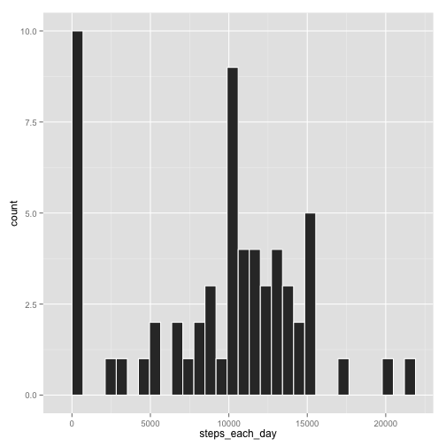
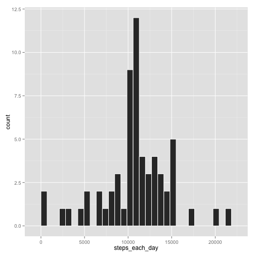
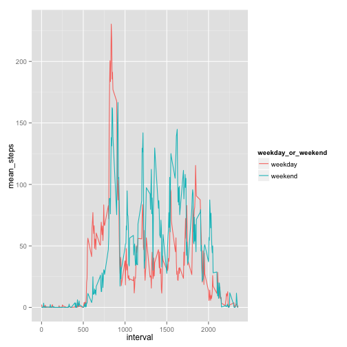
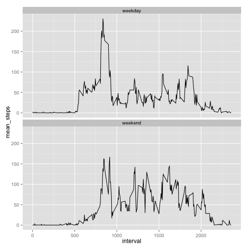

## Loading and preprocessing the data

```r
setwd("/Users/Tammy/online_courses/data_science/RepData_PeerAssessment1")
dat<- read.csv(unz("activity.zip","activity.csv"))
dat$date<- as.Date(dat$date)
```

## What is mean total number of steps taken per day?

```r
library(dplyr)
library(ggplot2)
dat<- tbl_df(dat)
steps_per_day<- dat %>% group_by(date) %>% summarise(steps_each_day=sum(steps, na.rm=T))
# make a histogram
ggplot(steps_per_day) + geom_histogram(aes(x=steps_each_day), color="white")
```

```
## stat_bin: binwidth defaulted to range/30. Use 'binwidth = x' to adjust this.
```

 

Calculate and report the mean and median of the total number of steps taken per day


```r
dat %>% group_by(date) %>% summarise(mean_steps=mean(steps, na.rm=T), 
                                     median_steps=median(steps, na.rm=T)) %>% print(n=61)
```

```
## Source: local data frame [61 x 3]
## 
##          date mean_steps median_steps
## 1  2012-10-01         NA           NA
## 2  2012-10-02  0.4375000            0
## 3  2012-10-03 39.4166667            0
## 4  2012-10-04 42.0694444            0
## 5  2012-10-05 46.1597222            0
## 6  2012-10-06 53.5416667            0
## 7  2012-10-07 38.2465278            0
## 8  2012-10-08        NaN           NA
## 9  2012-10-09 44.4826389            0
## 10 2012-10-10 34.3750000            0
## 11 2012-10-11 35.7777778            0
## 12 2012-10-12 60.3541667            0
## 13 2012-10-13 43.1458333            0
## 14 2012-10-14 52.4236111            0
## 15 2012-10-15 35.2048611            0
## 16 2012-10-16 52.3750000            0
## 17 2012-10-17 46.7083333            0
## 18 2012-10-18 34.9166667            0
## 19 2012-10-19 41.0729167            0
## 20 2012-10-20 36.0937500            0
## 21 2012-10-21 30.6284722            0
## 22 2012-10-22 46.7361111            0
## 23 2012-10-23 30.9652778            0
## 24 2012-10-24 29.0104167            0
## 25 2012-10-25  8.6527778            0
## 26 2012-10-26 23.5347222            0
## 27 2012-10-27 35.1354167            0
## 28 2012-10-28 39.7847222            0
## 29 2012-10-29 17.4236111            0
## 30 2012-10-30 34.0937500            0
## 31 2012-10-31 53.5208333            0
## 32 2012-11-01        NaN           NA
## 33 2012-11-02 36.8055556            0
## 34 2012-11-03 36.7048611            0
## 35 2012-11-04        NaN           NA
## 36 2012-11-05 36.2465278            0
## 37 2012-11-06 28.9375000            0
## 38 2012-11-07 44.7326389            0
## 39 2012-11-08 11.1770833            0
## 40 2012-11-09        NaN           NA
## 41 2012-11-10        NaN           NA
## 42 2012-11-11 43.7777778            0
## 43 2012-11-12 37.3784722            0
## 44 2012-11-13 25.4722222            0
## 45 2012-11-14        NaN           NA
## 46 2012-11-15  0.1423611            0
## 47 2012-11-16 18.8923611            0
## 48 2012-11-17 49.7881944            0
## 49 2012-11-18 52.4652778            0
## 50 2012-11-19 30.6979167            0
## 51 2012-11-20 15.5277778            0
## 52 2012-11-21 44.3993056            0
## 53 2012-11-22 70.9270833            0
## 54 2012-11-23 73.5902778            0
## 55 2012-11-24 50.2708333            0
## 56 2012-11-25 41.0902778            0
## 57 2012-11-26 38.7569444            0
## 58 2012-11-27 47.3819444            0
## 59 2012-11-28 35.3576389            0
## 60 2012-11-29 24.4687500            0
## 61 2012-11-30        NaN           NA
```


## What is the average daily activity pattern?

```r
interval_mean_steps<- dat %>% group_by(interval) %>% summarise(mean_steps_per_interval=mean(steps, na.rm=T))
ggplot(interval_mean_steps) + geom_line(aes(x=interval, y=mean_steps_per_interval))
```

 

Which 5-minute interval, on average across all the days in the dataset, contains the maximum  number of steps?


```r
interval_mean_steps %>% arrange(desc(mean_steps_per_interval)) %>% head(n=1)
```

```
## Source: local data frame [1 x 2]
## 
##   interval mean_steps_per_interval
## 1      835                206.1698
```
## Imputing missing values
How many NAs in the orignal dataset?(how many rows contain NAs?)

```r
table(complete.cases(dat))
```

```
## 
## FALSE  TRUE 
##  2304 15264
```
There are total 2304 rows containing NAs.

use the mean of that 5 min interval of all days to impute the missing NAs

```r
dat_no_NA<- dat
for (i in which(is.na(dat$steps))){
        idx<- interval_mean_steps$interval == as.numeric(dat[i,3])
        imputing_value<- as.numeric(interval_mean_steps[idx,2])
        dat_no_NA[i,1]<- imputing_value
}
```
histogram of total number of steps taken each day

```r
steps_per_day_no_NA<- dat_no_NA %>% group_by(date) %>% 
        summarise(steps_each_day=sum(steps, na.rm=T))
ggplot(steps_per_day_no_NA) + geom_histogram(aes(x=steps_each_day), color="white")
```

```
## stat_bin: binwidth defaulted to range/30. Use 'binwidth = x' to adjust this.
```

 

After imputing missing values, in some of the days, the mean steps are very close to the median 
steps

```r
dat_no_NA %>% group_by(date) %>% summarise(mean_steps=mean(steps, na.rm=T), 
                                     median_steps=median(steps, na.rm=T)) %>% print(n=61)
```

```
## Source: local data frame [61 x 3]
## 
##          date mean_steps median_steps
## 1  2012-10-01 37.3825996     34.11321
## 2  2012-10-02  0.4375000      0.00000
## 3  2012-10-03 39.4166667      0.00000
## 4  2012-10-04 42.0694444      0.00000
## 5  2012-10-05 46.1597222      0.00000
## 6  2012-10-06 53.5416667      0.00000
## 7  2012-10-07 38.2465278      0.00000
## 8  2012-10-08 37.3825996     34.11321
## 9  2012-10-09 44.4826389      0.00000
## 10 2012-10-10 34.3750000      0.00000
## 11 2012-10-11 35.7777778      0.00000
## 12 2012-10-12 60.3541667      0.00000
## 13 2012-10-13 43.1458333      0.00000
## 14 2012-10-14 52.4236111      0.00000
## 15 2012-10-15 35.2048611      0.00000
## 16 2012-10-16 52.3750000      0.00000
## 17 2012-10-17 46.7083333      0.00000
## 18 2012-10-18 34.9166667      0.00000
## 19 2012-10-19 41.0729167      0.00000
## 20 2012-10-20 36.0937500      0.00000
## 21 2012-10-21 30.6284722      0.00000
## 22 2012-10-22 46.7361111      0.00000
## 23 2012-10-23 30.9652778      0.00000
## 24 2012-10-24 29.0104167      0.00000
## 25 2012-10-25  8.6527778      0.00000
## 26 2012-10-26 23.5347222      0.00000
## 27 2012-10-27 35.1354167      0.00000
## 28 2012-10-28 39.7847222      0.00000
## 29 2012-10-29 17.4236111      0.00000
## 30 2012-10-30 34.0937500      0.00000
## 31 2012-10-31 53.5208333      0.00000
## 32 2012-11-01 37.3825996     34.11321
## 33 2012-11-02 36.8055556      0.00000
## 34 2012-11-03 36.7048611      0.00000
## 35 2012-11-04 37.3825996     34.11321
## 36 2012-11-05 36.2465278      0.00000
## 37 2012-11-06 28.9375000      0.00000
## 38 2012-11-07 44.7326389      0.00000
## 39 2012-11-08 11.1770833      0.00000
## 40 2012-11-09 37.3825996     34.11321
## 41 2012-11-10 37.3825996     34.11321
## 42 2012-11-11 43.7777778      0.00000
## 43 2012-11-12 37.3784722      0.00000
## 44 2012-11-13 25.4722222      0.00000
## 45 2012-11-14 37.3825996     34.11321
## 46 2012-11-15  0.1423611      0.00000
## 47 2012-11-16 18.8923611      0.00000
## 48 2012-11-17 49.7881944      0.00000
## 49 2012-11-18 52.4652778      0.00000
## 50 2012-11-19 30.6979167      0.00000
## 51 2012-11-20 15.5277778      0.00000
## 52 2012-11-21 44.3993056      0.00000
## 53 2012-11-22 70.9270833      0.00000
## 54 2012-11-23 73.5902778      0.00000
## 55 2012-11-24 50.2708333      0.00000
## 56 2012-11-25 41.0902778      0.00000
## 57 2012-11-26 38.7569444      0.00000
## 58 2012-11-27 47.3819444      0.00000
## 59 2012-11-28 35.3576389      0.00000
## 60 2012-11-29 24.4687500      0.00000
## 61 2012-11-30 37.3825996     34.11321
```

## Are there differences in activity patterns between weekdays and weekends?
add a column containing whether it is a weekday or weekend

```r
dat_weekday_weekend<- dat_no_NA %>% 
        mutate(weekday_or_weekend= ifelse(weekdays(date)=="Saturday" | 
                                                        weekdays(date) == "Sunday",
                                               "weekend", "weekday"))
dat_weekday_weekend$weekday_or_weekend<- as.factor(dat_weekday_weekend$weekday_or_weekend)
```
calculate the average steps every 5 min interval for weekdays and weekends

```r
weekday_weekend_mean_steps<- dat_weekday_weekend %>% group_by(weekday_or_weekend, interval) %>%
        summarise(mean_steps=mean(steps))
```

plot a line graph for the mean steps of weekdays and weekends respectively.


```r
ggplot(weekday_weekend_mean_steps) + geom_line(aes(x=interval, y=mean_steps,
                                                   colour=weekday_or_weekend))
```

 

or to make two plots in two panels


```r
ggplot(weekday_weekend_mean_steps) + geom_line(aes(x=interval, y=mean_steps)) +
        facet_grid(weekday_or_weekend ~ .)
```

 

### use facet_wrap rather than use facet_grid


```r
ggplot(weekday_weekend_mean_steps) + geom_line(aes(x=interval, y=mean_steps)) +
        facet_wrap(~weekday_or_weekend, ncol=1)
```

 

### it looks like this person took more steps over the weekends on average.
